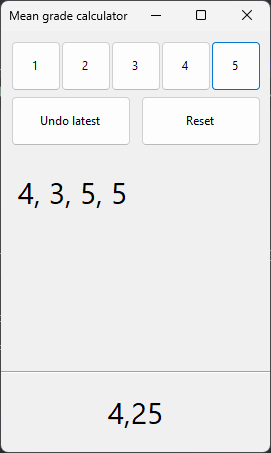
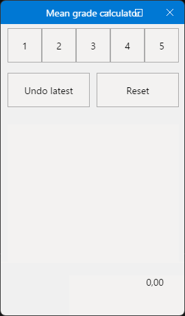

# School grades mean value calculator

This is a simple Windows Forms (and Modern.Forms) application that helps with calculating the mean value of student grades in five-grade system.

Inspired by [version of my friend](https://github.com/SashaKilin/Middle-School-Mark).

## Usage

At first, [install .NET SDK 7](https://dot.net/install). Berify your installation by running `dotnet --version` in your terminal.

Then download this repository source code. If you prefer, use any Git client you prefer.

### Windows Forms

This will work only on Windows.

Open up your terminal and navigate to the source code folder.

Then, go to `SchooolGradesMean.Windows` folder and run `dotnet run`.

You can also run the app from Visual Studio as always you do. Just open solution or project, and then run by pressing shortcut, or `Debug > Start Without Debugging`.

### Modern.Forms

To run the Modern.Forms version, navigate to the `SchoolGradesMean.ModernForms` folder and run `dotnet restore` and then `dotnet run`.

Modern.Forms version have some visual issues like text and app window decoration, but it just works!

## ToDo list

* Fix Modern.Forms version visual issues
* Style app a bit
* Add ability to use any grade system
* Add tables input (`csv`, `xls`, etc.)

## License

Licensed under [MIT license](./License.txt).
